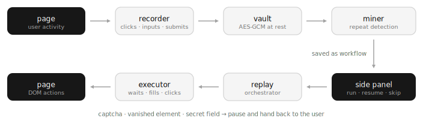

# Automated Web

[](https://github.com/arsenstorm/automated-web/actions/workflows/validate.yml)
[](https://scorecard.dev/viewer/?uri=github.com/arsenstorm/automated-web)

A local-first browser workflow automation extension. 

It passively observes your browsing, mines repeated flows on-device, suggests them as workflows,
and replays them step by step — pausing and handing control back whenever it
can't proceed safely. Everything stays in your browser: no server, no
analytics, encrypted at rest.

<picture>
  <source media="(prefers-color-scheme: dark)" srcset=".github/architecture-dark.svg">
  
</picture>

<!-- demo video goes here -->

## How it works

**Capture.** A content script buffers navigations, clicks, input changes, and
form submits on whatever page you're on (re-edits of the same field collapse
into one event). The buffer flushes to the background every few seconds and
on page hide, where it is encrypted before touching storage.

**Mining.** Once a minute, an alarm splits the event stream into per-origin
sessions (a session ends on an origin change, a 60-second idle gap, or
navigating back to the page the flow started on). Each session is cut at
form submits — the natural end of a task — and fingerprinted by its *action
shape*: origins, pathnames, and selectors only, never input values. When the
same shape repeats often enough (3× by default, configurable), a toast on
that origin offers to save it as a workflow. Suggestions can be dismissed
once or muted per-site, and everything happens on-device.

**Recording.** Don't want to wait for the miner? A record button cuts a
workflow directly from what you do in the active tab.

**Replay.** The background orchestrator reuses the active tab when it's
already on the start URL (or opens one), waits for loads, and drives the
page one step at a time through the content-script executor. Between steps
the run state is persisted, so the side panel shows live progress and a
service-worker restart can never lose track of a run.

## Security model

- **Local-only.** No server, no telemetry, no analytics. The Firefox build
  declares [`data_collection_permissions: none`](./wxt.config.ts).
- **Encrypted at rest.** Recorded events, mined patterns, and saved workflows
  are AES-GCM-256 encrypted in `storage.local` ([`lib/vault.ts`](./lib/vault.ts)).
- **Locked means dormant.** While the vault is locked nothing records, mines,
  or runs — and a run that reaches an input step mid-lock pauses rather than
  typing into the page.
- **Secrets are opt-in.** By default, password and credit-card values are
  redacted before they leave the page, and replay pauses for you to type
  them.
- **Reset is a real escape hatch.** A forgotten password can't be recovered;
  resetting the vault wipes everything encrypted under it.

### Permissions

| Permission      | Why                                                        |
| --------------- | ---------------------------------------------------------- |
| `<all_urls>`    | Passive capture runs wherever you browse; also grants the `tab.url` reads that tab matching needs |
| `storage`       | Encrypted workflows/events/patterns, plus settings          |
| `alarms`        | Periodic mining while the service worker sleeps             |
| `notifications` | "Workflow stuck / finished" alerts                          |
| `sidePanel`     | The UI lives in the side panel                              |

## Reliability model

The replayer's rule is **pause, never guess**:

- Elements are awaited with a MutationObserver (10s budget), not polled.
- Selectors prefer stable attributes (`id`, `data-testid`, `name`,
  `aria-label`) and reject machine-generated ids; only then fall back to a
  short positional path. For clicks, the recorded text is ground truth — if
  a positional selector drifts onto the wrong element, replay rescues via a
  unique text match instead of clicking the wrong thing.
- Inputs go through the native value setter so React-controlled forms
  actually see the change.
- Timeouts, captchas, and secret fields pause the run with a reason; the
  side panel offers resume/skip and a desktop notification pings you.
- A service-worker restart mid-run pauses the run instead of risking a
  double-executed step.

## Known limitations

Deliberate prototype edges, roughly in the order they'd matter:

- No iframe or shadow-DOM traversal — capture and replay see the top document.
- One run at a time.
- Pattern matching is exact-fingerprint; reordered or slightly-varying flows
  count as different patterns (fuzzy/LCS matching is the noted upgrade path).
- No semantic/AI target matching — this is a deterministic automation
  substrate, not an agent.
- Multi-tab workflows aren't modelled; a workflow lives in one tab.

## Development

```sh
bun install
bun run dev          # start dev, then load .output/chrome-mv3 as unpacked
bun run dev:firefox  # same, for Firefox
bun run build        # production build (build:firefox for Firefox)
bun run zip          # package for the store
```

## Scripts

| Script            | Description                          |
| ----------------- | ------------------------------------ |
| `bun run check`   | Lint + format check (Ultracite)      |
| `bun run fix`     | Auto-fix lint/format                 |
| `bun run compile` | TypeScript typecheck                 |
| `bun run test`    | Unit tests (Vitest)                  |
| `bun run build`   | Build the extension                  |

## Contributing

See [`CONTRIBUTING.md`](./CONTRIBUTING.md). Security issues: [`SECURITY.md`](./SECURITY.md).

## License

[MIT](./LICENSE)
